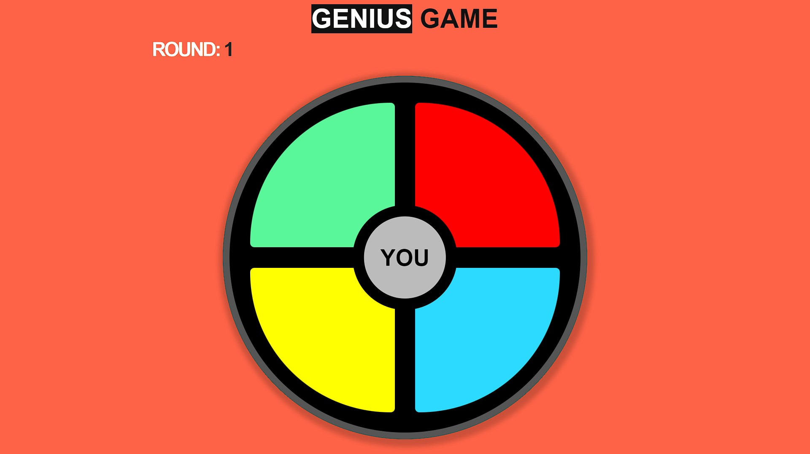

# Oi, tudo bem? 🙃

Esse é o repositório (modificado) de uma aula de Javascript, na qual foi feito um simples jogo Genius com apenas algumas linhas de código! 

### Os requisitos são:

* [HTML básico](https://www.w3schools.com/html/)
* [CSS básico](https://developer.mozilla.org/pt-BR/docs/Web/CSS)
* [Javascript básico](https://developer.mozilla.org/pt-BR/docs/Web/JavaScript)

## 🚀 Let's code! 🚀
[Link](https://github.com/SpruceGabriela/genesis-dio) para o repositório original!👇👇 
